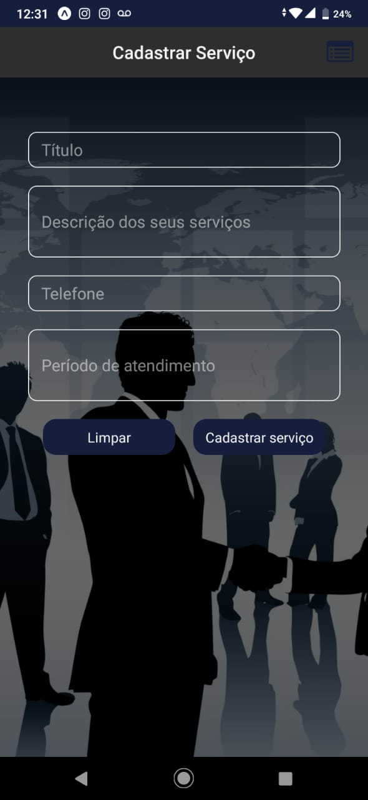

# Achei Serviços

Aplicativo móvel para cadastramento e publicação de serviços.

 Ao acessar o aplicativo o usuário poderá ver a lista de serviços cadastrados com o nome do serviço, descrição telefone e horário de atendimento. No canto superior esquerdo dessa mesma lista de está o ícone que redireciona a página para cadastrar novos serviços. O usuário poderá ver o seu serviço cadastrado na lista logo após o registro do mesmo na página de cadastramento.

  

