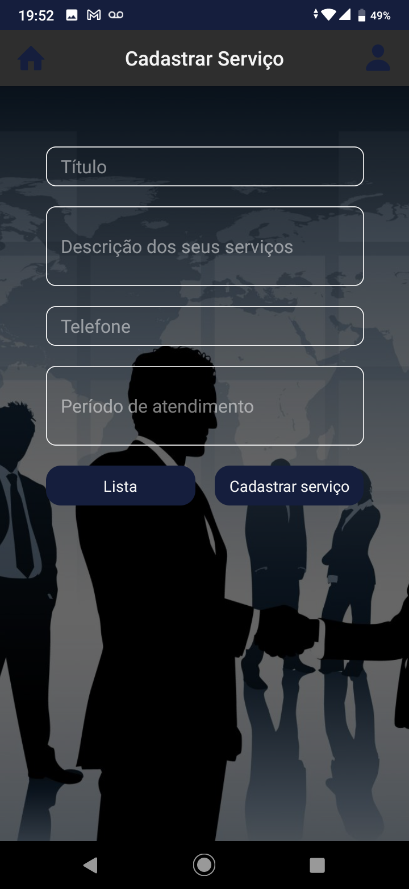
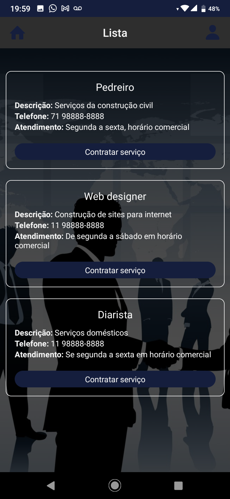

# Servicefinder

Aplicativo móvel para contratação e cadastramento de serviços.

 O usuário realiza um cadastro usando nome, telefone e senha. Então poderá cadastrar um serviço presto por sua empresa ou por ele mesmo. Da mesma forma também pode contratar um serviço cadastrado por outra pessoa ou empresa.

  

